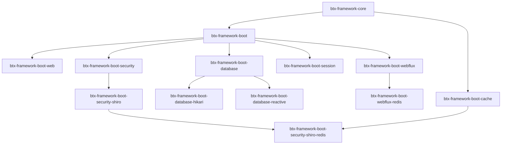
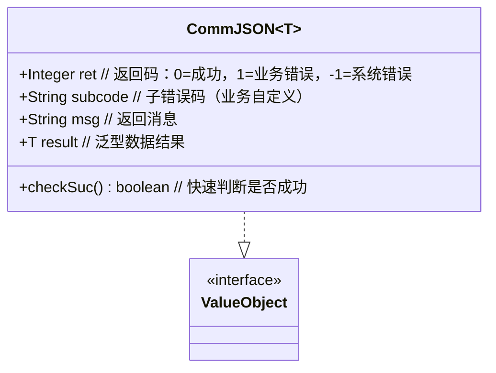
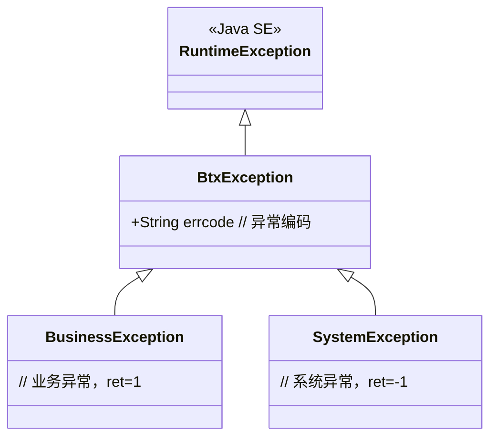
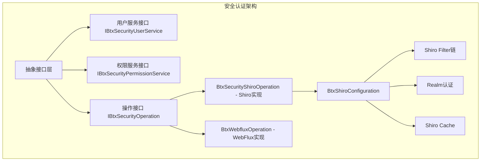
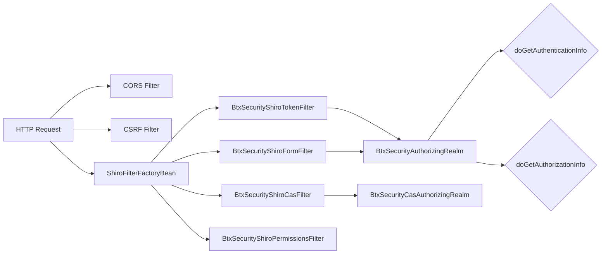
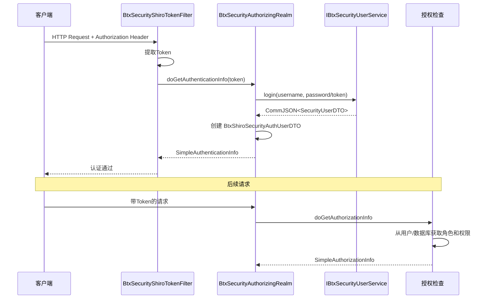
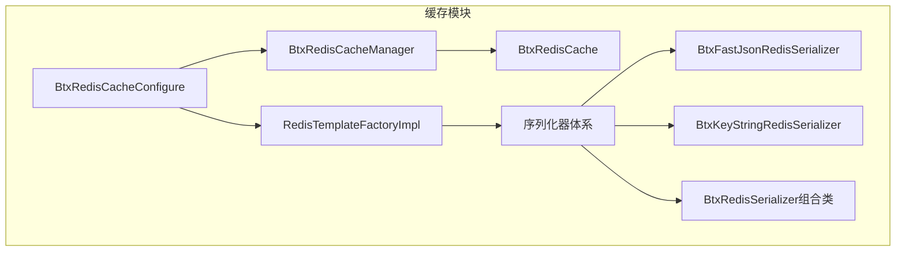
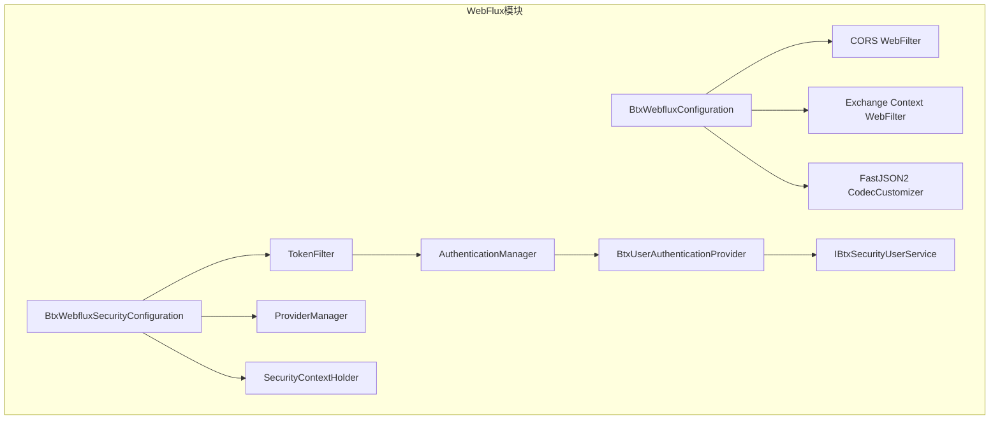

# BTX Framework v1.3.0-SNAPSHOT 详细设计文档

| 修订记录 | | |
|---------|------|------|
| 版本 | 日期 | 说明 |
| v1.0 | 2026-06-03 | 初始版本，涵盖全部模块的详细设计 |

## 1. 项目概述

BTX Framework 是一个基于 **Spring Boot 3.x + JDK 17** 的企业级应用开发框架，定位为自用 Spring Boot 脚手架（"自用springboot脚手架"）。框架版本为 `1.3.0-SNAPSHOT`，遵循 Apache 2.0 开源协议。

框架的核心设计目标是提供一套开箱即用、模块化、可插拔的企业级开发基础设施，涵盖 **Web 层快速开发、安全认证授权、缓存、数据库访问、分布式会话** 等常见场景。

## 2. 整体架构

### 2.1 项目模块层次结构

```
btx-framework-root                          # 根项目 (pom)
├── btx-framework-parent                    # 全局依赖版本管理父POM
├── btx-framework/
│   ├── btx-framework-dependencies          # BOM依赖管理 (供外部项目导入)
│   ├── btx-framework-core                  # 核心模块
│   ├── btx-framework-boot                  # Spring Boot基础模块
│   ├── btx-framework-boot-web              # Web MVC模块 (Servlet)
│   ├── btx-framework-boot-webflux          # WebFlux响应式模块
│   ├── btx-framework-boot-webflux-redis    # WebFlux Redis缓存模块
│   ├── btx-framework-boot-cache            # 缓存模块 (Redis)
│   ├── btx-framework-boot-security         # 安全认证抽象模块
│   ├── btx-framework-boot-security-shiro   # Shiro安全实现模块
│   ├── btx-framework-boot-security-shiro-redis  # Shiro Redis缓存模块
│   ├── btx-framework-boot-database         # 数据库基础模块 (MyBatis-Plus)
│   ├── btx-framework-boot-database-hikari  # HikariCP数据源加密模块
│   ├── btx-framework-boot-database-reactive    # 响应式数据库模块
│   └── btx-framework-boot-session          # Redis分布式会话模块
├── btx-projects/                           # 业务项目脚手架
└── btx-framework-local/                    # 本地定制化模块
```

### 2.2 模块依赖关系图



### 2.3 各模块依赖说明

```mermaid
graph TB
    subgraph "框架内部依赖关系"
        Core[btx-framework-core] --> Boot[btx-framework-boot]
        Core --> Security[btx-framework-boot-security]
        Core --> Cache[btx-framework-boot-cache]
        Boot --> Web[btx-framework-boot-web]
        Security --> Shiro[btx-framework-boot-security-shiro]
        Web --> Shiro
        Cache --> ShiroRedis[btx-framework-boot-security-shiro-redis]
        Shiro --> ShiroRedis
        Boot --> Database[btx-framework-boot-database]
        Database --> Hikari[btx-framework-boot-database-hikari]
        Boot --> WebFlux[btx-framework-boot-webflux]
        Security --> WebFlux
        Boot --> Session[btx-framework-boot-session]
        Cache --> Session
    end

    subgraph "核心外部依赖"
        FJ[FastJSON2] --> Web
        FJ --> WebFlux
        FJ --> Cache
        SBW[spring-boot-starter-web] --> Web
        SBWF[spring-boot-starter-webflux] --> WebFlux
        SBR[spring-boot-starter-data-redis] --> Cache
        MP[mybatis-plus-spring-boot3-starter] --> Database
        ShiroLib[Shiro jakarta] --> Shiro
        CASLib[CAS Client] --> Shiro
        BCLib[Bouncy Castle] --> Shiro
        SSR[spring-session-data-redis] --> Session
        Caffeine[caffeine] --> WebFlux
        JWT[hutool-jwt] --> WebFlux
    end

    style Core fill:#e1f5fe
    style Boot fill:#e1f5fe
    style Web fill:#e1f5fe
    style Cache fill:#e1f5fe
    style Security fill:#e1f5fe
    style Shiro fill:#e1f5fe
    style ShiroRedis fill:#e1f5fe
    style Database fill:#e1f5fe
    style Hikari fill:#e1f5fe
    style WebFlux fill:#e1f5fe
    style Session fill:#e1f5fe
```



**关键依赖说明：**
- **FastJSON2**：在 web、webflux、cache 三个模块中使用，替代 Jackson 作为默认 JSON 处理框架
- **Shiro 版本**：使用 Jakarta 分类器的 Shiro（`.jakarta`），兼容 Spring Boot 3.x Jakarta Servlet API
- **CAS 客户端**：`cas-client-support-saml` 4.0.4，排除旧版 Bouncy Castle 和 Nimbus JWT
- **MyBatis-Plus**：`mybatis-plus-spring-boot3-starter` 适配 Spring Boot 3.x
- **Session 模块**：通过 cache 模块间接引入 Redis 依赖
- **WebFlux 模块**：caffeine 用于本地缓存，hutool-jwt 用于 JWT 令牌支持

### 2.4 核心设计理念

| 理念 | 说明 |
|------|------|
| **约定优于配置** | 框架提供默认配置，大部分场景无需额外配置即可运行 |
| **模块化可插拔** | 各模块通过 `@ConditionalOnProperty` / `@ConditionalOnClass` 控制自动装配 |
| **接口抽象** | 安全认证采用接口抽象 + Shiro 实现的模式，支持多种认证方式 |
| **统一响应模型** | 全局使用 `CommJSON<T>` 统一返回格式 |
| **全局异常处理** | 统一异常处理 + 层次化异常类体系 |

## 3. 核心模块 (btx-framework-core)

### 3.1 模块定位

作为整个框架的基石，提供所有模块共用的基础设施，包括：统一响应模型、异常体系、常量定义。

### 3.2 核心类详解

#### 3.2.1 统一响应模型 - [`CommJSON<T>`](btx-framework/btx-framework-core/src/main/java/top/cheesetree/btx/framework/core/json/CommJSON.java:16)



**设计要点：**
- `ret` 字段仿照 HTTP 状态码设计：0 表示成功，负数表示系统异常，正数表示业务异常
- 提供多种构造函数，支持链式创建
- `checkSuc()` 方法用于快速判断业务执行是否成功

#### 3.2.2 异常体系



**异常编码规范**（参见 [`ExceptionCodeUtil`](btx-framework/btx-framework-core/src/main/java/top/cheesetree/btx/framework/core/exception/ExceptionCodeUtil.java:10)）：
格式：`系统编码-业务编码-预留码(0000)-具体异常码(4位数字)`
例如：`SYS-USER-0000-1001`

#### 3.2.3 消息常量 - [`BtxMessage`](btx-framework/btx-framework-core/src/main/java/top/cheesetree/btx/framework/core/constants/BtxMessage.java:13)

| 常量名 | ret | message | 说明 |
|--------|-----|---------|------|
| `SUCCESS` | 0 | "" | 成功 |
| `BUSI_ERROR` | 1 | "业务错误" | 业务逻辑错误 |
| `SYSTEM_ERROR` | -1 | "系统错误" | 系统级错误 |
| `UNKOWN_ERROR` | -1 | "未知错误" | 未知异常 |
| `VALIDATE_ERROR` | 1 | "校验不通过" | 参数校验失败 |

## 4. Spring Boot 基础模块 (btx-framework-boot)

提供 [`ApplicationBeanFactory`](btx-framework/btx-framework-boot/src/main/java/top/cheesetree/btx/framework/boot/spring/ApplicationBeanFactory.java:15) 工具类，实现 `ApplicationContextAware` 接口，在非 Spring 管理的类中也能获取 Spring Bean。

## 5. Web MVC 模块 (btx-framework-boot-web)

### 5.1 功能架构

```mermaid
graph TB
    subgraph "btx-framework-boot-web"
        Config[BtxWebMvcConfiguration] --> FastJson[FastJson2 HTTP Message Converter]
        Config --> BtxWebProperties[配置属性]
        Handler[BtxWebExceptionHandler] --> CommJSON
        Utils[HttpUtil / RequestUtil]
        Model[FileInfoDTO]
    end
    FastJson -->|替换| Jackson[Spring Boot默认Jackson]
    Handler -->|@ControllerAdvice| GlobalException[全局异常拦截]
```

### 5.2 核心类详解

#### 5.2.1 [`BtxWebMvcConfiguration`](btx-framework/btx-framework-boot-web/src/main/java/top/cheesetree/btx/framework/web/config/BtxWebMvcConfiguration.java:30)

**职责：** 替换 Spring MVC 默认的 Jackson 消息转换器为 FastJSON2。

**核心逻辑：**
1. 创建 `FastJsonHttpMessageConverter` 并注册多种 MediaType
2. 配置 FastJSON 特征：`FieldBased`（基于字段序列化）、`SupportArrayToBean`
3. 根据 [`BtxWebProperties`](btx-framework/btx-framework-boot-web/src/main/java/top/cheesetree/btx/framework/web/config/BtxWebProperties.java:13) 配置日期格式（默认 `yyyy-MM-dd HH:mm:ss`）
4. 替换原有的 `AbstractJackson2HttpMessageConverter`

**关键配置项（`btx.web.*`）：**
| 属性 | 默认值 | 说明 |
|------|--------|------|
| `dateformat` | `yyyy-MM-dd HH:mm:ss` | 日期格式化 |
| `writedateusedateformat` | `true` | 是否使用日期格式 |

#### 5.2.2 [`BtxWebExceptionHandler`](btx-framework/btx-framework-boot-web/src/main/java/top/cheesetree/btx/framework/web/handle/BtxWebExceptionHandler.java:29)

**职责：** 全局统一异常处理。

**处理策略：**
- `BtxException` → 根据子类型返回不同 ret 码（BusinessException 返回 1，其他返回 -1）
- `BindException` → 参数校验失败，返回 400+错误详情
- 未知异常 → 生成 UUID 追踪ID，返回 -1

#### 5.2.3 [`HttpUtil`](btx-framework/btx-framework-boot-web/src/main/java/top/cheesetree/btx/framework/web/util/HttpUtil.java:38)

**职责：** 封装 HTTP 客户端操作，基于 Spring 6 的 `RestClient` 和 `RestTemplate`。

**支持功能：**
- GET/POST/PUT/DELETE/PATCH 请求
- JSON/Form 提交
- 文件上传（Multipart）
- HTTPS 双向忽略证书验证
- 自定义超时设置

#### 5.2.4 [`RequestUtil`](btx-framework/btx-framework-boot-web/src/main/java/top/cheesetree/btx/framework/web/util/RequestUtil.java:14)

**职责：** 判断请求是否为 AJAX 异步请求。

**判断依据：**
1. `Accept` 头包含 `application/json`
2. `X-Requested-With` 头包含 `XMLHttpRequest`
3. URI 以 `.json` / `.xml` 结尾
4. 参数 `__ajax=json` 或 `__ajax=xml`

## 6. 安全认证模块

### 6.1 整体设计



### 6.2 抽象接口层 (btx-framework-boot-security)

#### 6.2.1 核心接口

| 接口 | 类型参数 | 核心方法 |
|------|---------|---------|
| [`IBtxSecurityOperation<T,A>`](btx-framework/btx-framework-boot-security/src/main/java/top/cheesetree/btx/framework/security/IBtxSecurityOperation.java:13) | T: 用户DTO, A: 认证信息 | `login()`, `logout()`, `getUserId()`, `getUserInfo()`, `getAuthInfo()`, `runas()` |
| [`IBtxSecurityUserService<T>`](btx-framework/btx-framework-boot-security/src/main/java/top/cheesetree/btx/framework/security/IBtxSecurityUserService.java:11) | T: 用户DTO | `login()`, `logout()`, `gethdImgurl()`, `changePwd()`, `getUserInfo()` |
| [`IBtxSecurityPermissionService<T,F,R>`](btx-framework/btx-framework-boot-security/src/main/java/top/cheesetree/btx/framework/security/IBtxSecurityPermissionService.java:14) | T: 菜单, F: 功能, R: 角色 | `getMenu()`, `getFunc()`, `getAllFunc()`, `getRole()` |

#### 6.2.2 数据模型

| 类 | 说明 |
|----|------|
| [`SecurityUserDTO`](btx-framework/btx-framework-boot-security/src/main/java/top/cheesetree/btx/framework/security/model/SecurityUserDTO.java) | 用户基本信息（uid, name, funcs, roles, group等） |
| [`SecurityAuthUserDTO`](btx-framework/btx-framework-boot-security/src/main/java/top/cheesetree/btx/framework/security/model/SecurityAuthUserDTO.java) | 认证用户（包含用户信息+认证信息） |
| [`SecurityRoleDTO`](btx-framework/btx-framework-boot-security/src/main/java/top/cheesetree/btx/framework/security/model/SecurityRoleDTO.java) | 角色（roleCode, roleName） |
| [`SecurityFuncDTO`](btx-framework/btx-framework-boot-security/src/main/java/top/cheesetree/btx/framework/security/model/SecurityFuncDTO.java) | 功能权限（funcCode, funcName, actionLink） |
| [`SecurityMenuDTO`](btx-framework/btx-framework-boot-security/src/main/java/top/cheesetree/btx/framework/security/model/SecurityMenuDTO.java) | 菜单（menuCode, menuName, parentCode, url, icon等） |
| [`SecurityGroupDTO`](btx-framework/btx-framework-boot-security/src/main/java/top/cheesetree/btx/framework/security/model/SecurityGroupDTO.java) | 用户组（groupCode, name, roles, funcs等） |

#### 6.2.3 认证类型枚举

```java
public enum AuthType {
    SESSION,    // 基于 Session 的认证（表单登录）
    TOKEN,      // 基于 Token 的认证（用户名+密码）
    JWT,        // JWT 认证（预留）
    CAS,        // CAS 单点登录
    EXT_TOKEN   // 外部 Token 认证（仅需 Token 串）
}
```

### 6.3 Shiro 安全实现模块 (btx-framework-boot-security-shiro)

#### 6.3.1 架构设计



#### 6.3.2 [`BtxShiroConfiguration`](btx-framework/btx-framework-boot-security-shiro/src/main/java/top/cheesetree/btx/framework/security/shiro/config/BtxShiroConfiguration.java:58)

**职责：** Shiro 核心配置类，装配完整的 Shiro 安全环境。

**主要 Bean 装配：**

| Bean | 说明 |
|------|------|
| `shiroFilter` | Shiro 过滤器工厂，配置认证过滤器、权限映射 |
| `authenticator` | `BtxModularRealmAuthenticator`，支持多 Realm 策略 |
| `shiroCacheManager` | `MemoryConstrainedCacheManager`（默认内部缓存） |
| `subjectFactory` | `StatelessDefaultSubjectFactory`，禁用 Session 创建 |
| `sessionManager` | `DefaultWebSessionManager`，配置 Session 超时 |
| `securityManager` | `DefaultWebSecurityManager`，组合上述组件 |

**过滤器链配置逻辑：**
1. 排除路径（`contextInterceptorExcludePathPatterns`）→ `anon`
2. 登录页、未授权页、错误页、过期页 → `anon`
3. 自动权限映射（`autoPermission=true`）→ 从数据库加载所有功能点，自动匹配 `perms[funcCode]`
4. 根据 `authType` 选择认证过滤器（Token/Form/CAS）
5. 所有剩余路径 → `authc`

#### 6.3.3 认证过滤器体系

| 过滤器 | 适用认证类型 | 说明 |
|--------|-------------|------|
| [`BtxSecurityShiroTokenFilter`](btx-framework/btx-framework-boot-security-shiro/src/main/java/top/cheesetree/btx/framework/security/shiro/filter/BtxSecurityShiroTokenFilter.java:31) | TOKEN, EXT_TOKEN | 从 Header/Parameter 读取 Token，创建 `StatelessToken` 提交认证 |
| [`BtxSecurityShiroFormFilter`](btx-framework/btx-framework-boot-security-shiro/src/main/java/top/cheesetree/btx/framework/security/shiro/filter/BtxSecurityShiroFormFilter.java:24) | SESSION | 继承 Shiro 的 `FormAuthenticationFilter`，支持 AJAX 响应 |
| [`BtxSecurityShiroCasFilter`](btx-framework/btx-framework-boot-security-shiro/src/main/java/top/cheesetree/btx/framework/security/shiro/support/cas/BtxSecurityShiroCasFilter.java) | CAS | CAS 单点登录票据验证 |
| [`BtxSecurityShiroUserFilter`](btx-framework/btx-framework-boot-security-shiro/src/main/java/top/cheesetree/btx/framework/security/shiro/filter/BtxSecurityShiroUserFilter.java:24) | 通用 | 用户身份验证过滤器，支持 AJAX 响应 |
| [`BtxSecurityShiroPermissionsFilter`](btx-framework/btx-framework-boot-security-shiro/src/main/java/top/cheesetree/btx/framework/security/shiro/filter/BtxSecurityShiroPermissionsFilter.java:25) | 通用 | 权限授权过滤器，支持 AJAX 响应 |

**各过滤器实现详解：**

**`BtxSecurityShiroTokenFilter`** 继承 `AuthenticatingFilter`，核心实现：
- **Token 提取**（`getToken`）：先尝试从 HTTP Header 中读取 `tokenKey` 指定的请求头，若为空则从请求参数中获取
- **Token 创建**（`createToken`）：若忽略 Token 模式或 Token 不为空，创建 `StatelessToken(token)` 提交认证
- **访问控制**（`isAccessAllowed`）：若 `ignoreToken=true` 或 Token 值存在，调用 `executeLogin` 执行登录流程
- **拒绝处理**（`onAccessDenied`）：判断是否为 AJAX 请求，是则返回 401 JSON 响应，否则重定向到 `errorurl`

**`BtxSecurityShiroPermissionsFilter`** 继承 `PermissionsAuthorizationFilter`：
- 重写 `onAccessDenied` 方法，对于 AJAX 请求直接返回 403 JSON 响应（`SECURIT_UNAUTH_ERROR`），非 AJAX 请求则调用父类默认处理

**`BtxSecurityShiroUserFilter`** 继承 `UserFilter`：
- 重写 `onAccessDenied` 方法，AJAX 请求返回 401 JSON 响应，非 AJAX 请求调用父类进行页面跳转

**`BtxSecurityShiroFormFilter`** 继承 `FormAuthenticationFilter`：
- 重写 `onAccessDenied` 方法，支持 AJAX 请求的 JSON 响应，非 AJAX 请求执行原始表单登录跳转逻辑

**`BtxSecurityShiroCasFilter`** 继承 `AuthenticatingFilter`：
- **Token 创建**：从请求参数中获取 `ticket` 参数（CAS 票据），创建 `CasToken(ticket)`
- **登录失败处理**（`onLoginFailure`）：复杂的三路分支逻辑
  1. 用户已认证/已记住/跳过验证 → 直接重定向到成功页面
  2. 带有 `ticket` 参数但验证失败 → 重定向到 `errorurl` 并附带错误消息
  3. 无 `ticket` 参数（首次访问）→ 重定向到 CAS 登录页 `serverLoginUrl?service=当前URL`
- **登录成功**：重定向到成功页面

#### 6.3.4 Token 认证流程



#### 6.3.5 Realm 设计

[`BtxSecurityAuthorizingRealm`](btx-framework/btx-framework-boot-security-shiro/src/main/java/top/cheesetree/btx/framework/security/shiro/realm/BtxSecurityAuthorizingRealm.java:35)

- **认证（doGetAuthenticationInfo）**：调用 `IBtxSecurityUserService.login()` 进行用户认证，成功后包装为 `BtxShiroSecurityAuthUserDTO`
- **授权（doGetAuthorizationInfo）**：优先从已缓存的用户对象中获取角色/权限，否则调用 `IBtxSecurityPermissionService`
- **缓存支持**：通过 `BtxShiroCacheProperties` 控制认证/授权缓存

#### 6.3.6 安全过滤器链（CORS/CSRF）

| 过滤器 | 条件 | 说明 |
|--------|------|------|
| [`BtxSecurityShiroCorsFilter`](btx-framework/btx-framework-boot-security-shiro/src/main/java/top/cheesetree/btx/framework/security/shiro/filter/BtxSecurityShiroCorsFilter.java:24) | `btx.security.shiro.cors.enabled=true` | CORS 跨域支持，配置允许的 Origin/Methods/Headers |
| [`BtxSecurityShiroCsrfFilter`](btx-framework/btx-framework-boot-security-shiro/src/main/java/top/cheesetree/btx/framework/security/shiro/filter/BtxSecurityShiroCsrfFilter.java:29) | `btx.security.shiro.csrf.enabled=true` | CSRF 防护，通过 Referer 白名单校验 |

#### 6.3.7 异常处理

[`BtxShiroExceptionHandler`](btx-framework/btx-framework-boot-security-shiro/src/main/java/top/cheesetree/btx/framework/security/shiro/config/BtxShiroExceptionHandler.java:28)

- `UnauthorizedException` / `AuthorizationException` → 403 Forbidden
- `UnauthenticatedException` / `AuthenticationException` → 401 Unauthorized

### 6.4 Shiro Redis 缓存模块 (btx-framework-boot-security-shiro-redis)

当 `btx.security.shiro.cache.cache-type=REDIS` 时，使用 Redis 作为 Shiro 缓存。

- [`RedisShiroCacheManager`](btx-framework/btx-framework-boot-security-shiro-redis/src/main/java/top/cheesetree/btx/framework/security/shiro/cache/redis/RedisShiroCacheManager.java:18)：实现 `CacheManager` 接口，创建 `RedisShiroCache`
- [`RedisShiroCache`](btx-framework/btx-framework-boot-security-shiro-redis/src/main/java/top/cheesetree/btx/framework/security/shiro/cache/redis/RedisShiroCache.java:21)：实现 `Cache<K,V>` 接口，使用 RedisTemplate 操作缓存，支持 Lua 脚本实现原子性 get-del 操作

**`RedisShiroCache` 实现细节：**
- **get/put**：使用 `redisTemplate.opsForValue()` 操作，Key 格式为 `prefix:cacheKey`
- **put 设置过期**：调用 `set(rk, v, expire, TimeUnit.SECONDS)` 写入时同步设置 TTL
- **remove 原子删除**：使用 Lua 脚本 `getdel.lua` 实现，先获取值再删除，保证原子性
- **keys 扫描**：使用 Redis `SCAN` 命令通过前缀匹配查找所有 Key（替代 KEYS 命令避免阻塞）
- **clear 清空**：通过 `keys()` 获取所有 Key 后调用 `delete` 批量删除

### 6.5 辅助组件实现详解

#### 6.5.1 [`StatelessToken`](btx-framework/btx-framework-boot-security-shiro/src/main/java/top/cheesetree/btx/framework/security/shiro/subject/StatelessToken.java:16)

继承 `UsernamePasswordToken`，扩展了一个 `token` 字段（默认 UUID 随机生成），用于无状态 Token 认证。提供了多种构造函数：
- `StatelessToken(String token)` — EXT_TOKEN 模式，仅传入 Token 串
- `StatelessToken(String username, String password)` — TOKEN/SESSION 模式，传入用户名+密码
- `StatelessToken(String username, char[] password)` — 支持 char 数组密码，更安全

支持 `getUsername()` 和 `getToken()` 双重获取用户标识。

#### 6.5.2 [`StatelessDefaultSubjectFactory`](btx-framework/btx-framework-boot-security-shiro/src/main/java/top/cheesetree/btx/framework/security/shiro/subject/StatelessDefaultSubjectFactory.java:12)

继承 `DefaultWebSubjectFactory`，在 `createSubject()` 方法中调用 `context.setSessionCreationEnabled(false)`，彻底禁用 Session 创建。在 `TOKEN` / `EXT_TOKEN` / `JWT` 模式下配合 `BtxShiroConfiguration` 装配使用，实现无状态认证。

#### 6.5.3 [`BtxModularRealmAuthenticator`](btx-framework/btx-framework-boot-security-shiro/src/main/java/top/cheesetree/btx/framework/security/shiro/pam/BtxModularRealmAuthenticator.java:21)

继承 `ModularRealmAuthenticator`，重写 `doMultiRealmAuthentication` 方法，核心改进点：
- 遍历多个 Realm 时，若某 Realm 抛出 `AccountException` 或 `AuthenticationException`，**立即抛出**而不是继续尝试下一个 Realm
- 使用 `FirstSuccessfulStrategy` 认证策略，任一 Realm 认证成功后即可

#### 6.5.4 [`BtxNoAuthCredentialsMatcher`](btx-framework/btx-framework-boot-security-shiro/src/main/java/top/cheesetree/btx/framework/security/shiro/matcher/BtxNoAuthCredentialsMatcher.java)

空凭证匹配器，继承 `AllowAllCredentialsMatcher`，不验证凭证（密码）匹配，密码验证已在 `IBtxSecurityUserService.login()` 中完成，避免 Realm 重复校验。

#### 6.5.5 [`BtxSecurityShiroOperation.login()`](btx-framework/btx-framework-boot-security-shiro/src/main/java/top/cheesetree/btx/framework/security/shiro/BtxSecurityShiroOperation.java:44)

`login(String... args)` 方法实现无状态登录，核心逻辑：
1. **参数解析**：args[0]=用户名/Token/Ticket, args[1]=密码, args[2]=认证类型（可选覆盖配置）
2. **Token 创建**：根据 `AuthType` 创建不同类型的 `AuthenticationToken`：
   - `TOKEN/SESSION` → `StatelessToken(username, password)`
   - `EXT_TOKEN` → `StatelessToken(token)`
   - `CAS` → `CasToken(null, ticket)`
3. **执行登录**：调用 `SecurityUtils.getSubject().login(t)` 触发 Realm 认证
4. **结果处理**：认证成功返回用户信息，失败则解析异常消息（支持 JSON 格式的业务异常）

## 7. 缓存模块 (btx-framework-boot-cache)

### 7.1 架构设计



### 7.2 核心类详解

#### 7.2.1 [`BtxRedisCacheConfigure`](btx-framework/btx-framework-boot-cache/src/main/java/top/cheesetree/btx/framework/cache/redis/BtxRedisCacheConfigure.java:35)

**条件：** `spring.cache.type=redis` 时自动配置

**功能：**
1. 创建 `BtxRedisCacheManager`，支持全局和按缓存名称的差异化 TTL 配置
2. 使用 FastJSON2 的 `GenericFastJsonRedisSerializer` 进行值序列化
3. 注册 `RedisTemplateFactoryImpl` Bean 用于创建自定义 RedisTemplate

#### 7.2.2 [`BtxRedisCacheManager`](btx-framework/btx-framework-boot-cache/src/main/java/top/cheesetree/btx/framework/cache/redis/BtxRedisCacheManager.java:22)

继承 Spring Data Redis 的 `RedisCacheManager`，重写 `createRedisCache` 方法以支持：
- 按缓存名称独立配置 TTL（通过 `btx.redis.cache.caches.<cache-name>.*`）
- 动态创建缓存配置

#### 7.2.3 序列化器体系

**`BtxRedisSerializer`** 组合序列化器容器，持有 keySerializer、hashKeySerializer、valueSerializer、hashValueSerializer、stringSerializer 五个序列化器实例，供 `RedisTemplate` 配置使用。

**`BtxFastJsonRedisSerializer<T>`** 基于 FastJSON2 的泛型序列化器：
- 实现 `RedisSerializer<T>` 接口
- `serialize`：使用 `JSON.toJSONBytes(source, JSONWriter.Feature.WriteMapNullValue)` 将对象序列化为字节数组
- `deserialize`：使用 `JSON.parseObject(bytes, clazz, JSONReader.Feature.FieldBased)` 反序列化，支持默认构造函数缺失的场景
- 可指定目标类型 `clazz`，支持复杂泛型对象的反序列化

**`BtxKeyStringRedisSerializer`** 带前缀的 Key 序列化器：
- 继承 `StringRedisSerializer`，在序列化 key 时自动拼接前缀 `prefix + ":" + key`
- 在反序列化 key 时移除前缀
- 用于区分不同业务模块的 Redis Key 空间

**`BtxStringRedisSerializer`** 简化的 String 序列化包装器，使用 `StandardCharsets.UTF_8` 编码。

#### 7.2.4 [`RedisTemplateFactoryImpl`](btx-framework/btx-framework-boot-cache/src/main/java/top/cheesetree/btx/framework/cache/redis/RedisTemplateFactoryImpl.java:23)

工厂类，支持按 Key/Value 类型生成对应的 `RedisTemplate`：
- 使用 `KeyValueMapKey`（包含 keyClass, valueClass, needprefix, btxRedisSerializer）作为缓存的 Map Key
- **自动选择序列化器逻辑**：
  - Key 为 String 且 needprefix=true → `BtxKeyStringRedisSerializer(prefix)`
  - Key 为 String 且 needprefix=false → `StringRedisSerializer`
  - Key 为非 String → `BtxFastJsonRedisSerializer<TKey>(keyClz)`
  - Value 为 String → `StringRedisSerializer`
  - Value 为非 String → `BtxFastJsonRedisSerializer<TValue>(valueClz)`
- 内部使用 `ConcurrentHashMap` 缓存已创建的 RedisTemplate 实例，避免重复创建

#### 7.2.4 可配置属性

```yaml
btx:
  redis:
    cache:
      use-key-prefix: true
      key-prefix: "btx:"
      cache-null-values: true
      time-to-live: 3600s
      caches:
        myCache:
          time-to-live: 1800s
          use-key-prefix: true
          key-prefix: "my:"
```

## 8. 数据库模块

### 8.1 基础数据库模块 (btx-framework-boot-database)

基于 MyBatis-Plus 的自动配置：

- [`MybatisPlusConfigure`](btx-framework/btx-framework-boot-database/src/main/java/top/cheesetree/btx/framework/database/config/MybatisPlusConfigure.java:17)：配置分页插件，Mapper 扫描路径可配置
- [`Page`](btx-framework/btx-framework-boot-database/src/main/java/top/cheesetree/btx/framework/database/page/Page.java)：基础分页参数（pageSize, pageIndex）
- [`PageQuery`](btx-framework/btx-framework-boot-database/src/main/java/top/cheesetree/btx/framework/database/page/PageQuery.java)：带排序的分页查询参数
- [`PageResult`](btx-framework/btx-framework-boot-database/src/main/java/top/cheesetree/btx/framework/database/page/PageResult.java)：分页结果，包含 total、data、pageCount 计算

### 8.2 HikariCP 数据源加密模块 (btx-framework-boot-database-hikari)

- [`BtxHikariConfigure`](btx-framework/btx-framework-boot-database-hikari/src/main/java/top/cheesetree/btx/framework/database/hikari/BtxHikariConfigure.java:27)：提供 AES 加解密和 MD5 工具方法
- [`BtxHikariBeanPostProcessor`](btx-framework/btx-framework-boot-database-hikari/src/main/java/top/cheesetree/btx/framework/database/hikari/BtxHikariBeanPostProcessor.java:20)：作为 `BeanPostProcessor`，在 HikariCP 数据源初始化后解密密码

**密码加密机制：**
1. 使用 `appId + "_" + secretKey + "_" + appId` 的 MD5 作为 AES 密钥
2. 密钥的第 3-19 位作为 AES CBC 模式的 IV
3. 密文使用 Base64 URL 编码

```yaml
btx:
  datasource:
    app-id: your-app-id
    secret-key: your-secret-key
```

## 9. WebFlux 响应式模块 (btx-framework-boot-webflux)

### 9.1 架构设计



### 9.2 核心功能

- CORS 跨域支持（通过 WebFilter 实现）
- Request Context 持有（通过 Reactor Context 传递 `ServerWebExchange`）
- FastJSON2 编解码（替换默认 Jackson）
- 无状态安全认证（Token 模式）

### 9.3 WebFlux 安全认证

[`BtxWebfluxOperation`](btx-framework/btx-framework-boot-webflux/src/main/java/top/cheesetree/btx/framework/webflux/security/BtxWebfluxOperation.java:38)

- 使用 `AuthenticationManager` 管理认证流程
- 支持 Token 缓存（Caffeine / Redis）
- `SecurityContextHolder` 基于 Reactor Context 实现线程安全

## 10. 分布式会话模块 (btx-framework-boot-session)

基于 Spring Session Data Redis 实现分布式会话：

- [`BtxRedisSessionConfig`](btx-framework/btx-framework-boot-session/src/main/java/top/cheesetree/btx/framework/web/session/config/BtxRedisSessionConfig.java:12)：配置 Redis HTTP Session 存储
- [`BtxSessionConfigProperties`](btx-framework/btx-framework-boot-session/src/main/java/top/cheesetree/btx/framework/web/session/config/BtxSessionConfigProperties.java:17)：Session 配置（namespace、timeout、saveMode）

## 11. 配置属性汇总

### 11.1 Web 配置 (`btx.web.*`)

```yaml
btx:
  web:
    dateformat: yyyy-MM-dd HH:mm:ss
    writedateusedateformat: true
```

### 11.2 安全配置 (`btx.security.*`)

```yaml
btx:
  security:
    context-interceptor-exclude-path-patterns:
      - /api/public/**
    error-path: /error
    login-path: /login
    no-auth-path: /unauth
    expire-path: /expire
    shiro:
      session-time-out: 1800
      auth-type: TOKEN       # SESSION | TOKEN | JWT | CAS | EXT_TOKEN
      token-key: Authorization
      auto-permission: false
      ignore-token: false
      cookie-name:
      cache:
        enabled: true
        cache-type: INNER     # INNER | REDIS
        authentication-cache-name: authenticationCache
        authorization-cache-name: authorizationCache
        cache-expire: 1800
      cors:
        enabled: false
        allow-credentials: "true"
      csrf:
        enabled: false
      cas:
        server-url-prefix:
        server-login-url:
        client-host-url:
        validation-type: CAS3
        proxy-callback-url:
        proxy-receptor-url:
        skip-ticket-validation: false
        dev-user-name:
```

### 11.3 Redis 缓存配置 (`btx.redis.cache.*`)

```yaml
btx:
  redis:
    cache:
      use-key-prefix: true
      key-prefix: "btx:"
      cache-null-values: true
      time-to-live: 3600s
      caches:
        cacheName:
          time-to-live: 1800s
```

### 11.4 数据库配置

```yaml
btx:
  datasource:
    app-id: 
    secret-key:
mybatis-plus:
  mapper-scan: top.cheesetree.**.mapper
```

### 11.5 Session 配置

```yaml
btx:
  session:
    namespace: spring:session
btx.session.timeout: PT30M
```

## 12. 模块使用建议

| 场景 | 推荐依赖 |
|------|---------|
| 基础 REST API 开发 | `btx-framework-boot-web` |
| 需要用户认证授权 | + `btx-framework-boot-security-shiro` |
| 需要 Redis 缓存 | + `btx-framework-boot-cache` |
| Shiro 缓存用 Redis | + `btx-framework-boot-security-shiro-redis` |
| 需要 MyBatis-Plus | + `btx-framework-boot-database` |
| HikariCP 密码加密 | + `btx-framework-boot-database-hikari` |
| 分布式 Session | + `btx-framework-boot-session` |
| 响应式 WebFlux | + `btx-framework-boot-webflux` |
| WebFlux Redis 缓存 | + `btx-framework-boot-webflux-redis` |
