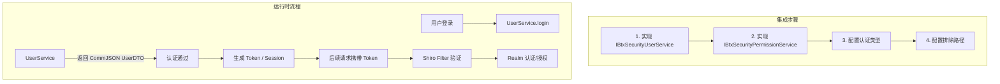
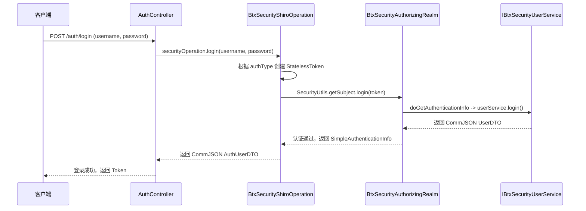

# BTX Framework v1.3.0-SNAPSHOT 使用文档

| 修订记录 | | |
|---------|------|------|
| 版本 | 日期 | 说明 |
| v1.0 | 2026-06-03 | 初始版本，涵盖全部模块的使用说明 |

## 1. 快速开始

### 1.1 环境要求

- JDK 17+
- Maven 3.6+
- Spring Boot 3.x

### 1.2 引入依赖

在项目的 `pom.xml` 中引入 BOM 和所需模块：

```xml
<!-- 导入 BOM 管理版本 -->
<dependencyManagement>
    <dependencies>
        <dependency>
            <groupId>top.cheesetree.btx.framework</groupId>
            <artifactId>btx-framework-dependencies</artifactId>
            <version>${btx.framework.version}</version>
            <type>pom</type>
            <scope>import</scope>
        </dependency>
    </dependencies>
</dependencyManagement>

<!-- 引入所需模块 -->
<dependencies>
    <!-- Web MVC 模块（必选） -->
    <dependency>
        <groupId>top.cheesetree.btx.framework</groupId>
        <artifactId>btx-framework-boot-web</artifactId>
    </dependency>
    
    <!-- 缓存模块（可选） -->
    <dependency>
        <groupId>top.cheesetree.btx.framework</groupId>
        <artifactId>btx-framework-boot-cache</artifactId>
    </dependency>
    
    <!-- 安全模块（可选） -->
    <dependency>
        <groupId>top.cheesetree.btx.framework.security</groupId>
        <artifactId>btx-framework-boot-security-shiro</artifactId>
    </dependency>
    
    <!-- 数据库模块（可选） -->
    <dependency>
        <groupId>top.cheesetree.btx.framework</groupId>
        <artifactId>btx-framework-boot-database</artifactId>
    </dependency>
</dependencies>
```

## 2. Web MVC 模块使用

### 2.1 功能说明

引入 `btx-framework-boot-web` 后自动生效：
- 将 Spring MVC 的 `HttpMessageConverter` 替换为 FastJSON2
- 注册全局异常处理器
- 提供 HTTP 请求工具类

### 2.2 配置项

```yaml
btx:
  web:
    # 日期格式化（默认：yyyy-MM-dd HH:mm:ss）
    dateformat: "yyyy-MM-dd HH:mm:ss"
    # 是否使用日期格式输出日期字段（默认：true）
    writedateusedateformat: true
```

### 2.3 全局异常处理

框架已注册全局异常处理器，统一返回 `CommJSON` 格式：

```json
{
    "ret": 0,           // 0=成功, 1=业务错误, -1=系统错误
    "subcode": "",      // 子错误码
    "msg": "",          // 消息
    "result": null      // 业务数据
}
```

业务代码中可直接抛出异常：
```java
// 业务异常（ret=1）
throw new BusinessException("用户名已存在", "USER_001");

// 系统异常（ret=-1）
throw new SystemException("数据库连接失败", "DB_001");
```

### 2.4 统一响应模型

Controller 中直接返回数据对象或使用 `CommJSON`：

```java
@RestController
public class UserController {
    
    // 方法1：直接返回数据，自动包装为 CommJSON
    @GetMapping("/user/{id}")
    public UserDTO getUser(@PathVariable String id) {
        return userService.getById(id);
    }
    
    // 方法2：手动包装 CommJSON
    @PostMapping("/user/login")
    public CommJSON<LoginResult> login(@RequestBody LoginDTO dto) {
        LoginResult result = userService.login(dto);
        return new CommJSON<>(result);
    }
    
    // 方法3：带子错误码
    @GetMapping("/user/funcs")
    public CommJSON<List<FuncDTO>> getUserFuncs() {
        List<FuncDTO> funcs = funcService.getUserFuncs();
        return new CommJSON<>("FUNC_001", funcs);
    }
}
```

### 2.5 HTTP 工具类使用

`HttpUtil` 提供便捷的 HTTP 请求方法：

```java
// GET 请求
String result = HttpUtil.httpGet("https://api.example.com/data", false);

// POST JSON 请求
String data = "{\"name\":\"test\"}";
String result = HttpUtil.httpPostJson("https://api.example.com/submit", data, false);

// POST Form 请求
HashMap<String, String> params = new HashMap<>();
params.put("username", "admin");
params.put("password", "123456");
String result = HttpUtil.httpAjaxPost("https://api.example.com/login", params, false);

// 文件上传
FileInfoDTO fileInfo = new FileInfoDTO();
fileInfo.setFilename("test.txt");
fileInfo.setFiledata(fileBytes);
String result = HttpUtil.httpUploadFile("https://api.example.com/upload", fileInfo, false);

// 自定义请求方法
HashMap<String, String> headers = new HashMap<>();
headers.put("Authorization", "Bearer xxx");
String result = HttpUtil.httpRequest(url, body, headers, 10000, false, HttpMethod.PUT);
```

### 2.6 判断 AJAX 请求

```java
// 在 Controller 或 Filter 中判断
if (RequestUtil.isAjaxRequest(request)) {
    // 返回 JSON 数据
} else {
    // 返回页面
}
```

## 3. 缓存模块使用

### 3.1 启用 Redis 缓存

添加依赖并配置 `spring.cache.type=redis` 后自动启用。

### 3.2 配置项

```yaml
spring:
  cache:
    type: redis
  data:
    redis:
      host: localhost
      port: 6379

btx:
  redis:
    cache:
      # 是否使用Key前缀
      use-key-prefix: true
      # Key前缀
      key-prefix: "btx:"
      # 是否缓存空值
      cache-null-values: true
      # 默认 TTL
      time-to-live: 3600s
      # 按缓存名称独立配置
      caches:
        userCache:
          time-to-live: 1800s
          key-prefix: "user:"
        sessionCache:
          time-to-live: 7200s
```

### 3.3 使用 Spring Cache 注解

```java
@Service
public class UserService {
    
    @Cacheable(value = "userCache", key = "#id")
    public UserDTO getById(String id) {
        // 从数据库查询
        return userMapper.selectById(id);
    }
    
    @CacheEvict(value = "userCache", key = "#user.id")
    public void update(UserDTO user) {
        userMapper.updateById(user);
    }
    
    @CachePut(value = "userCache", key = "#result.id")
    public UserDTO create(UserDTO user) {
        userMapper.insert(user);
        return user;
    }
}
```

### 3.4 使用 RedisTemplate 工厂

```java
@Service
public class RedisService {
    @Autowired
    private RedisTemplateFactoryImpl redisTemplateFactory;
    
    public void demo() {
        // 生成 String -> String 类型的 RedisTemplate
        RedisTemplate<String, String> strTemplate = 
            redisTemplateFactory.generateRedisTemplate(String.class);
        
        // 生成 String -> UserDTO 类型的 RedisTemplate
        RedisTemplate<String, UserDTO> userTemplate = 
            redisTemplateFactory.generateRedisTemplate(UserDTO.class);
        
        // 生成指定 Key/Value 类型的 RedisTemplate
        RedisTemplate<String, List<UserDTO>> listTemplate = 
            redisTemplateFactory.generateRedisTemplate(String.class, 
                (Class<List<UserDTO>>)(Class<?>)List.class);
        
        // 不使用 Key 前缀
        RedisTemplate<String, String> noPrefixTemplate = 
            redisTemplateFactory.generateRedisTemplate(String.class, String.class, false);
        
        // 使用自定义序列化器
        BtxRedisSerializer serializer = new BtxRedisSerializer();
        RedisTemplate<String, UserDTO> customTemplate = 
            redisTemplateFactory.generateRedisTemplate(String.class, UserDTO.class, serializer);
        
        // 使用示例
        strTemplate.opsForValue().set("key", "value");
        String value = strTemplate.opsForValue().get("key");
    }
}
```

## 4. 安全模块使用

### 4.0 模块选择说明：btx-framework-boot-security-shiro vs btx-framework-boot-security-shiro-redis

| 模块 | 功能 | 缓存方式 | 适用场景 |
|------|------|---------|---------|
| `btx-framework-boot-security-shiro` | Shiro 认证授权核心实现 | 内置 `MemoryConstrainedCacheManager`（内存缓存） | 单机部署、缓存量小、无需持久化 |
| `btx-framework-boot-security-shiro-redis` | Shiro 认证授权 + Redis 缓存 | `RedisShiroCacheManager`（Redis 缓存） | 集群部署、需要缓存共享/持久化 |

**区别要点：**
1. **缓存实现**：`shiro` 模块默认使用 JVM 内存缓存 `MemoryConstrainedCacheManager`，重启后缓存丢失；`shiro-redis` 模块使用 Redis 存储认证/授权缓存，支持分布式共享和持久化
2. **依赖关系**：`shiro-redis` 模块依赖于 `btx-framework-boot-cache` 模块的 `RedisTemplateFactoryImpl`
3. **切换方式**：在配置中设置 `btx.security.shiro.cache.cache-type=INNER` 使用内存缓存，`=REDIS` 使用 Redis 缓存
4. **建议**：单机开发/测试时可仅引入 `shiro` 模块；生产环境集群部署建议同时引入 `shiro` + `shiro-redis` 模块，并启用 Redis 缓存

```xml
<!-- 仅 Shiro 核心（使用内存缓存） -->
<dependency>
    <groupId>top.cheesetree.btx.framework.security</groupId>
    <artifactId>btx-framework-boot-security-shiro</artifactId>
</dependency>

<!-- Shiro 核心 + Redis 缓存（推荐生产环境） -->
<dependency>
    <groupId>top.cheesetree.btx.framework.security</groupId>
    <artifactId>btx-framework-boot-security-shiro</artifactId>
</dependency>
<dependency>
    <groupId>top.cheesetree.btx.framework.security</groupId>
    <artifactId>btx-framework-boot-security-shiro-redis</artifactId>
</dependency>
```

### 4.1 整体工作流程



### 4.2 实现用户服务接口

```java
@Component
public class MyUserService implements IBtxSecurityUserService<BtxShiroSecurityUserDTO> {
    
    @Autowired
    private UserMapper userMapper;
    
    @Override
    public CommJSON<BtxShiroSecurityUserDTO> login(String... loginArgs) {
        String username = loginArgs[0];   // 第一个参数：用户名
        String password = loginArgs[1];   // 第二个参数：密码（原始）
        
        // 1. 验证用户名密码
        User user = userMapper.findByUsername(username);
        if (user == null || !passwordEncoder.matches(password, user.getPassword())) {
            return new CommJSON<>(BtxSecurityMessage.SECURIT_LOGIN_ERROR);
        }
        
        // 2. 构建用户信息
        BtxShiroSecurityUserDTO userDTO = new BtxShiroSecurityUserDTO();
        userDTO.setUid(user.getId());
        userDTO.setName(user.getDisplayName());
        // ... 设置其他属性
        
        return new CommJSON<>(userDTO);
    }
    
    @Override
    public CommJSON logout() {
        return new CommJSON<>("");
    }
    
    @Override
    public CommJSON<String> gethdImgurl(String url, String userid) {
        return new CommJSON<>("");
    }
    
    @Override
    public CommJSON changePwd(String userid, String loginpwd, String newpwd) {
        return new CommJSON<>("");
    }
    
    @Override
    public CommJSON<BtxShiroSecurityUserDTO> getUserInfo(String uid) {
        return new CommJSON<>(userDTO);
    }
}
```

### 4.3 实现权限服务接口

```java
@Component
public class MyPermissionService 
    implements IBtxSecurityPermissionService<BtxShiroSecurityMenuDTO, 
                                              BtxShiroSecurityFuncDTO, 
                                              BtxShiroSecurityRoleDTO> {
    
    @Autowired
    private PermissionMapper permissionMapper;
    
    @Override
    public List<BtxShiroSecurityMenuDTO> getMenu(String userid, String authlevel) {
        return permissionMapper.getMenusByUserId(userid);
    }
    
    @Override
    public List<BtxShiroSecurityFuncDTO> getFunc(String userid) {
        return permissionMapper.getFuncsByUserId(userid);
    }
    
    @Override
    public List<BtxShiroSecurityFuncDTO> getAllFunc() {
        return permissionMapper.getAllFuncs();
    }
    
    @Override
    public List<BtxShiroSecurityRoleDTO> getRole(String userid) {
        return permissionMapper.getRolesByUserId(userid);
    }
}
```

### 4.4 配置不同认证方式

#### 4.4.1 TOKEN 认证模式

```yaml
btx:
  security:
    shiro:
      auth-type: TOKEN
      token-key: Authorization
    context-interceptor-exclude-path-patterns:
      - /api/public/**
      - /login
```

**登录请求：**
```bash
POST /login
Content-Type: application/json
{"username": "admin", "password": "123456"}
```

**后续请求：**
```bash
GET /api/users
Authorization: <token>
```

#### 4.4.2 SESSION 认证模式

```yaml
btx:
  security:
    shiro:
      auth-type: SESSION
    login-path: /login
```

登录后自动创建 Session，后续请求通过 Cookie 维持会话。

#### 4.4.3 EXT_TOKEN 外部 Token 模式

```yaml
btx:
  security:
    shiro:
      auth-type: EXT_TOKEN
      token-key: X-Auth-Token
```

仅需 Token 串即可认证（无需密码），适用于外部系统对接。

#### 4.4.4 CAS 单点登录模式

```yaml
btx:
  security:
    shiro:
      auth-type: CAS
      cas:
        server-url-prefix: https://cas.example.com/cas
        server-login-url: https://cas.example.com/cas/login
        client-host-url: https://myapp.example.com
        validation-type: CAS3
        proxy-callback-url:                         # 可选，CAS代理回调URL
        proxy-receptor-url:                          # 可选，CAS代理接收URL
        skip-ticket-validation: false                # 开发模式跳过票据验证
        dev-user-name:                               # 开发模式默认用户名
```

> **注意**：`skip-ticket-validation` 为 `true` 时，CAS 过滤器会跳过票据验证，直接登录成功（开发环境使用）。结合 `dev-user-name` 可在开发模式下指定默认登录用户。

### 4.5 自动权限映射

当 `btx.security.shiro.auto-permission=true` 时，框架会自动从数据库加载所有功能点，并为每个功能点的 `actionLink` 配置 `perms[funcCode]` 拦截规则。

### 4.6 CORS 配置

```yaml
btx:
  security:
    shiro:
      cors:
        enabled: true
        allow-credentials: "true"
```

### 4.7 CSRF 防护

```yaml
btx:
  security:
    shiro:
      csrf:
        enabled: true
        domains:
          - example.com
          - myapp.com
```

### 4.8 获取当前用户信息

```java
@RestController
public class UserController {
    
    @Autowired
    private IBtxSecurityOperation<BtxShiroSecurityUserDTO, AuthTokenInfo> securityOperation;
    
    @GetMapping("/current-user")
    public CommJSON<?> getCurrentUser() {
        // 获取用户ID
        String userId = securityOperation.getUserId();
        
        // 获取完整用户信息
        BtxShiroSecurityUserDTO user = securityOperation.getUserInfo();
        
        // 获取认证信息（如 Token）
        AuthTokenInfo authInfo = securityOperation.getAuthInfo();
        
        return new CommJSON<>(user);
    }
    
    @PostMapping("/logout")
    public CommJSON<Object> logout() {
        return securityOperation.logout();
    }
}
```

### 4.9 使用 BtxSpringSecurityController 获取用户信息

框架提供 [`BtxSpringSecurityController`](btx-framework/btx-framework-boot-security-shiro/src/main/java/top/cheesetree/btx/framework/security/shiro/controller/BtxSpringSecurityController.java:14) 作为基础 Controller，封装了获取当前用户信息的通用方法。业务 Controller 可直接继承它。

```java
import top.cheesetree.btx.framework.security.shiro.controller.BtxSpringSecurityController;
import top.cheesetree.btx.framework.security.shiro.model.AuthTokenInfo;
import top.cheesetree.btx.framework.security.shiro.model.BtxShiroSecurityUserDTO;

@RestController
@RequestMapping("/api")
public class MyBaseController extends BtxSpringSecurityController<BtxShiroSecurityUserDTO, AuthTokenInfo> {

    @GetMapping("/current-user-id")
    public String getCurrentUserId() {
        // 继承自 BtxSpringSecurityController
        return getUserId();
    }

    @GetMapping("/current-user-info")
    public BtxShiroSecurityUserDTO getCurrentUser() {
        // 继承自 BtxSpringSecurityController
        return getUser();
    }

    @GetMapping("/current-auth-info")
    public AuthTokenInfo getCurrentAuthInfo() {
        // 继承自 BtxSpringSecurityController，获取 Token 等认证信息
        return getAuthInfo();
    }
}
```

继承 `BtxSpringSecurityController` 后自动注入 `IBtxSecurityOperation`，无需重复声明 `@Autowired`。

### 4.11 切换用户身份

```java
// 模拟切换用户（管理员模拟其他用户）
BtxShiroSecurityUserDTO targetUser = new BtxShiroSecurityUserDTO();
targetUser.setUid("user002");
securityOperation.runas(targetUser);
```

### 4.12 使用 BtxSecurityShiroOperation 自定义登录

框架提供 [`BtxSecurityShiroOperation`](btx-framework/btx-framework-boot-security-shiro/src/main/java/top/cheesetree/btx/framework/security/shiro/BtxSecurityShiroOperation.java:37) 作为 `IBtxSecurityOperation` 的 Shiro 实现，可在自定义 Controller 中注入并调用登录方法。

#### 4.12.1 在自定义 Controller 中调用登录

```java
import top.cheesetree.btx.framework.security.IBtxSecurityOperation;
import top.cheesetree.btx.framework.security.shiro.model.AuthTokenInfo;
import top.cheesetree.btx.framework.security.shiro.model.BtxShiroSecurityUserDTO;

@RestController
@RequestMapping("/auth")
public class AuthController {

    @Autowired
    private IBtxSecurityOperation<BtxShiroSecurityUserDTO, AuthTokenInfo> securityOperation;

    /**
     * 自定义登录接口
     * 支持多种认证方式：SESSION / TOKEN / EXT_TOKEN / CAS
     */
    @PostMapping("/login")
    public CommJSON<BtxShiroSecurityAuthUserDTO> login(@RequestBody LoginDTO dto) {
        // 参数说明：securityOperation.login(用户名, 密码, 认证类型)
        // - SESSION / TOKEN 模式：args[0]=用户名, args[1]=密码
        // - EXT_TOKEN 模式：args[0]=Token串
        // - CAS 模式：args[0]=Ticket
        return securityOperation.login(dto.getUsername(), dto.getPassword());
    }

    /**
     * 指定认证类型登录
     */
    @PostMapping("/login-by-type")
    public CommJSON<BtxShiroSecurityAuthUserDTO> loginByType(@RequestBody LoginDTO dto) {
        // 第三个参数指定认证类型：SESSION / TOKEN / JWT / CAS / EXT_TOKEN
        return securityOperation.login(dto.getUsername(), dto.getPassword(), "TOKEN");
    }

    /**
     * 退出登录
     */
    @PostMapping("/logout")
    public CommJSON<Object> logout() {
        return securityOperation.logout();
    }
}
```

#### 4.12.2 登录流程说明



### 4.13 权限注解使用

框架已通过 `DefaultAdvisorAutoProxyCreator` 开启 Shiro AOP 注解支持，可在 Controller / Service 方法上直接使用 Shiro 注解声明权限控制。

#### 4.13.1 常用注解

| 注解 | 说明 | 示例 |
|------|------|------|
| `@RequiresAuthentication` | 需要已认证（登录） | `@RequiresAuthentication` |
| `@RequiresUser` | 需要已认证或已记住 | `@RequiresUser` |
| `@RequiresGuest` | 允许游客访问 | `@RequiresGuest` |
| `@RequiresRoles` | 需要指定角色 | `@RequiresRoles("admin")` |
| `@RequiresPermissions` | 需要指定权限 | `@RequiresPermissions("user:view")` |

#### 4.13.2 使用示例

```java
import org.apache.shiro.authz.annotation.RequiresAuthentication;
import org.apache.shiro.authz.annotation.RequiresPermissions;
import org.apache.shiro.authz.annotation.RequiresRoles;

@RestController
@RequestMapping("/api/users")
public class UserController {

    // 需要登录才能访问
    @GetMapping("/profile")
    @RequiresAuthentication
    public CommJSON<UserDTO> getProfile() {
        return new CommJSON<>(userService.getCurrentUser());
    }

    // 需要 admin 角色才能访问
    @GetMapping("/list")
    @RequiresRoles("admin")
    public CommJSON<List<UserDTO>> listUsers() {
        return new CommJSON<>(userService.listAll());
    }

    // 需要 user:create 权限才能访问
    @PostMapping
    @RequiresPermissions("user:create")
    public CommJSON<Boolean> createUser(@RequestBody UserDTO dto) {
        return new CommJSON<>(userService.create(dto));
    }

    // 组合使用：需要 admin 角色且 user:delete 权限
    @DeleteMapping("/{id}")
    @RequiresRoles("admin")
    @RequiresPermissions("user:delete")
    public CommJSON<Boolean> deleteUser(@PathVariable String id) {
        return new CommJSON<>(userService.deleteById(id));
    }

    // 逻辑或：拥有 user:view 或 user:edit 任一权限即可
    @GetMapping("/{id}")
    @RequiresPermissions(value = {"user:view", "user:edit"}, logical = Logical.OR)
    public CommJSON<UserDTO> getUser(@PathVariable String id) {
        return new CommJSON<>(userService.getById(id));
    }
}
```

#### 4.13.3 异常处理

当权限校验失败时，[`BtxShiroExceptionHandler`](btx-framework/btx-framework-boot-security-shiro/src/main/java/top/cheesetree/btx/framework/security/shiro/config/BtxShiroExceptionHandler.java:28) 会自动拦截并返回统一 JSON：

| 异常 | HTTP 状态码 | 错误码 | 说明 |
|------|------------|--------|------|
| `UnauthenticatedException` | 401 | 20002 | 访问未登录 |
| `UnauthorizedException` | 403 | 20003 | 访问未授权 |

#### 4.13.4 权限数据来源与 Realm 授权逻辑

权限数据由 [`IBtxSecurityPermissionService`](btx-framework/btx-framework-boot-security/src/main/java/top/cheesetree/btx/framework/security/IBtxSecurityPermissionService.java:14) 提供，在 [`BtxSecurityAuthorizingRealm`](btx-framework/btx-framework-boot-security-shiro/src/main/java/top/cheesetree/btx/framework/security/shiro/realm/BtxSecurityAuthorizingRealm.java:35) 的 `doGetAuthorizationInfo` 方法中自动装配。

**授权逻辑源码解析：**

```java
@Override
protected AuthorizationInfo doGetAuthorizationInfo(PrincipalCollection principalCollection) {
    SimpleAuthorizationInfo info = new SimpleAuthorizationInfo();

    // 1. 从认证信息中获取当前用户
    BtxShiroSecurityAuthUserDTO u = principalCollection.getPrimaryPrincipal();

    List<? extends SecurityFuncDTO> funcs;
    List<? extends SecurityRoleDTO> roles;

    // 2. 获取功能权限：优先使用用户对象中已缓存的 funcs，
    //    如果为空则调用 IBtxSecurityPermissionService.getFunc() 查询数据库
    if (u.getUser().getFuncs() != null && !u.getUser().getFuncs().isEmpty()) {
        funcs = u.getUser().getFuncs();            // 从缓存获取
    } else {
        funcs = btxSecurityPermissionService.getFunc(u.getUser().getUid());  // 查询数据库
    }

    // 3. 获取角色：优先使用用户对象中已缓存的 roles，
    //    如果为空则调用 IBtxSecurityPermissionService.getRole() 查询数据库
    if (u.getUser().getRoles() != null && !u.getUser().getRoles().isEmpty()) {
        roles = u.getUser().getRoles();            // 从缓存获取
    } else {
        roles = btxSecurityPermissionService.getRole(u.getUser().getUid());  // 查询数据库
    }

    // 4. 将功能权限编码（funcCode）注入到 Shiro 权限集合
    if (funcs != null) {
        Set<String> stringPermissions = new HashSet<>();
        funcs.forEach(f -> stringPermissions.add(f.getFuncCode()));
        info.setStringPermissions(stringPermissions);  // 支持 @RequiresPermissions 注解
    }

    // 5. 将角色编码（roleCode）注入到 Shiro 角色集合
    if (roles != null) {
        Set<String> stringRoles = new HashSet<>();
        roles.forEach(r -> stringRoles.add(r.getRoleCode()));
        info.setRoles(stringRoles);                    // 支持 @RequiresRoles 注解
    }

    return info;
}
```

**核心策略：**

| 优先级 | 功能权限获取 | 角色获取 |
|--------|-------------|---------|
| 优先 | 从 `SecurityUserDTO.funcs` 缓存读取 | 从 `SecurityUserDTO.roles` 缓存读取 |
| 后备 | 调用 `IBtxSecurityPermissionService.getFunc(userId)` 查询数据库 | 调用 `IBtxSecurityPermissionService.getRole(userId)` 查询数据库 |

> **性能优化建议**：如果在 `IBtxSecurityUserService.login()` 返回的 `SecurityUserDTO` 中预先填充 `funcs` 和 `roles` 数据，Realm 授权时将直接从内存中读取，避免额外的数据库查询。这对于权限列表不变或变更不频繁的场景非常有效。

## 5. 数据库模块使用

### 5.1 MyBatis-Plus 配置

```yaml
mybatis-plus:
  mapper-scan: com.example.**.mapper
  global-config:
    db-config:
      id-type: auto
  configuration:
    map-underscore-to-camel-case: true
```

### 5.2 Mapper / Service / ServiceImpl 继承体系

使用 MyBatis-Plus 时，Mapper、Service、ServiceImpl 需要继承 MyBatis-Plus 提供的基类，以使用内置的 CRUD 方法。

#### 5.2.1 Entity 实体类

```java
import com.baomidou.mybatisplus.annotation.TableName;
import com.baomidou.mybatisplus.annotation.TableId;
import com.baomidou.mybatisplus.annotation.IdType;
import lombok.Data;

@Data
@TableName("sys_user")  // 对应数据库表名
public class User {
    @TableId(type = IdType.AUTO)  // 自增主键
    private Long id;
    private String username;
    private String password;
    private String displayName;
    private Integer status;
}
```

#### 5.2.2 Mapper 层

Mapper 接口需继承 `BaseMapper<T>`，其中 T 为 Entity 类型：

```java
import com.baomidou.mybatisplus.core.mapper.BaseMapper;
import org.apache.ibatis.annotations.Mapper;

@Mapper  // 或通过 @MapperScan 扫描
public interface UserMapper extends BaseMapper<User> {
    // 继承后自带：insert、deleteById、updateById、selectById、selectList、selectPage 等方法
    // 可在此添加自定义 SQL 方法
}
```

#### 5.2.3 Service 接口

Service 接口需继承 `IService<T>`：

```java
import com.baomidou.mybatisplus.extension.service.IService;

public interface UserService extends IService<User> {
    // 继承后自带：save、saveBatch、updateById、removeById、getById、list、page 等方法
    // 可在此添加自定义业务方法
    CommJSON<User> login(String username, String password);
    PageResult<UserDTO> queryUsers(PageQuery pageQuery);
}
```

#### 5.2.4 ServiceImpl 实现类

ServiceImpl 需继承 `ServiceImpl<M extends BaseMapper<T>, T>` 并实现 Service 接口：

```java
import com.baomidou.mybatisplus.extension.service.impl.ServiceImpl;
import org.springframework.stereotype.Service;

@Service
public class UserServiceImpl extends ServiceImpl<UserMapper, User> implements UserService {
    // 继承后自带 save、updateById、removeById、getById、list、page 等实现
    // 可直接调用 baseMapper 或 this 访问内置方法
    
    @Override
    public CommJSON<User> login(String username, String password) {
        // 使用 lambdaQuery 快速查询
        User user = this.lambdaQuery()
            .eq(User::getUsername, username)
            .one();
        
        if (user == null || !password.equals(user.getPassword())) {
            return new CommJSON<>(BtxMessage.BUSI_ERROR.getCode(), "登录失败");
        }
        return new CommJSON<>(user);
    }
    
    @Override
    public PageResult<UserDTO> queryUsers(PageQuery pageQuery) {
        // 使用内置 page 方法
        Page<User> page = new Page<>(pageQuery.getPageIndex(), pageQuery.getPageSize());
        Page<User> result = this.page(page);
        
        return new PageResult<>(
            pageQuery.getPageIndex(),
            pageQuery.getPageSize(),
            result.getTotal(),
            result.getRecords().stream()
                .map(this::toDTO)
                .collect(Collectors.toList())
        );
    }
    
    private UserDTO toDTO(User user) {
        // Entity 转 DTO
        UserDTO dto = new UserDTO();
        dto.setId(user.getId());
        dto.setName(user.getDisplayName());
        return dto;
    }
}
```

#### 5.2.5 Controller 示例

```java
import com.baomidou.mybatisplus.core.conditions.query.LambdaQueryWrapper;

@RestController
@RequestMapping("/users")
public class UserController {
    
    @Autowired
    private UserService userService;
    
    @GetMapping("/{id}")
    public CommJSON<User> getById(@PathVariable Long id) {
        // 直接调用 IService 继承的方法
        return new CommJSON<>(userService.getById(id));
    }
    
    @PostMapping
    public CommJSON<Boolean> create(@RequestBody User user) {
        return new CommJSON<>(userService.save(user));
    }
    
    @PutMapping
    public CommJSON<Boolean> update(@RequestBody User user) {
        return new CommJSON<>(userService.updateById(user));
    }
    
    @DeleteMapping("/{id}")
    public CommJSON<Boolean> delete(@PathVariable Long id) {
        return new CommJSON<>(userService.removeById(id));
    }
    
    @GetMapping("/search")
    public CommJSON<List<User>> search(String keyword) {
        // 使用 lambdaQuery 构建条件
        List<User> list = userService.lambdaQuery()
            .like(User::getUsername, keyword)
            .eq(User::getStatus, 1)
            .list();
        return new CommJSON<>(list);
    }
}
```

#### 5.2.6 内置方法速查表

| 分类 | IService 方法 | BaseMapper 方法 |
|------|--------------|-----------------|
| 新增 | `save(entity)`, `saveBatch(list)` | `insert(entity)` |
| 删除 | `removeById(id)`, `remove(query)` | `deleteById(id)`, `delete(query)` |
| 修改 | `updateById(entity)`, `update(entity, query)` | `updateById(entity)`, `update(entity, query)` |
| 查询单条 | `getById(id)`, `getOne(query)` | `selectById(id)`, `selectOne(query)` |
| 查询列表 | `list()`, `list(query)` | `selectList(query)`, `selectBatchIds(ids)` |
| 分页 | `page(page, query)` | `selectPage(page, query)` |
| 条件构造 | `lambdaQuery()`, `lambdaUpdate()` | - |

### 5.3 分页查询

```java
@Service
public class UserService {
    
    @Autowired
    private UserMapper userMapper;
    
    public PageResult<UserDTO> queryUsers(PageQuery pageQuery) {
        LambdaQueryWrapper<User> wrapper = Wrappers.lambdaQuery();
        Page<User> page = new Page<>(pageQuery.getPageIndex(), pageQuery.getPageSize());
        Page<User> result = userMapper.selectPage(page, wrapper);
        
        return new PageResult<>(
            pageQuery.getPageIndex(),
            pageQuery.getPageSize(),
            result.getTotal(),
            result.getRecords().stream()
                .map(this::toDTO)
                .collect(Collectors.toList())
        );
    }
}

@RestController
public class UserController {
    @GetMapping("/users")
    public PageResult<UserDTO> listUsers(PageQuery pageQuery) {
        return userService.queryUsers(pageQuery);
    }
}
```

### 5.4 HikariCP 密码加密

```yaml
btx:
  datasource:
    app-id: myApp
    secret-key: mySecret
    
spring:
  datasource:
    url: jdbc:mysql://localhost:3306/db
    username: root
    password: <加密后的密码>
```

密码生成参考 `BtxHikariConfigure` 中的 `AESEncode` 方法。

### 5.5 Spring Boot / MyBatis-Plus 使用注意点

#### 5.5.1 Spring Boot 配置注意事项

1. **配置优先级**：Spring Boot 配置优先级依次为：命令行参数 `--key=value` > JNDI > 系统环境变量 > application.yml > application.properties。框架配置 `btx.*` 可被外部配置覆盖。

2. **自动配置类排除**：如果框架中某些自动配置不符合需求，可以通过 `@SpringBootApplication(exclude = {xxx.class})` 排除：
   ```java
   @SpringBootApplication(exclude = {
       BtxWebMvcConfiguration.class  // 排除框架的FastJSON配置，改用Jackson
   })
   ```

3. **多环境配置**：推荐使用 `application-{profile}.yml` 区分环境：
   ```yaml
   # application-dev.yml - 开发环境
   btx:
     security:
       shiro:
         auth-type: SESSION
         cache:
           cache-type: INNER

   # application-prod.yml - 生产环境
   btx:
     security:
       shiro:
         auth-type: TOKEN
         cache:
           cache-type: REDIS
   ```

4. **Lombok 注意事项**：使用 `@Data` 注解时需注意 `@EqualsAndHashCode` 默认包含所有字段，可能导致大对象性能问题。建议：
   - 实体类用 `@Getter` `@Setter` 代替 `@Data`
   - 或使用 `@EqualsAndHashCode(callSuper = false, exclude = {"largeField"})`

5. **配置刷新**：如果使用了 Spring Cloud Config，`btx.*` 配置项默认不支持动态刷新。如需动态刷新，可在相关类上添加 `@RefreshScope`。

#### 5.5.2 MyBatis-Plus 使用注意事项

1. **Mapper 扫描路径**：框架默认的扫描路径为 `top.cheesetree.**.mapper`，可通过配置修改：
   ```yaml
   mybatis-plus:
     mapper-scan: com.yourcompany.**.mapper
   ```
   或在启动类上使用 `@MapperScan` 覆盖。

2. **逻辑删除**：MyBatis-Plus 支持逻辑删除，推荐统一配置：
   ```yaml
   mybatis-plus:
     global-config:
       db-config:
         logic-delete-field: deleted       # 全局逻辑删除字段名
         logic-delete-value: 1             # 逻辑已删除值
         logic-not-delete-value: 0         # 逻辑未删除值
   ```
   使用逻辑删除后，框架自动在查询时追加 `deleted=0` 条件。

3. **自动填充**：使用 `@TableField(fill = FieldFill.INSERT_UPDATE)` 配合 MetaObjectHandler 实现创建时间、更新时间自动填充：
   ```java
   @Component
   public class MyMetaObjectHandler implements MetaObjectHandler {
       @Override
       public void insertFill(MetaObject metaObject) {
           this.strictInsertFill(metaObject, "createTime", LocalDateTime::now, LocalDateTime.class);
           this.strictInsertFill(metaObject, "updateTime", LocalDateTime::now, LocalDateTime.class);
       }
       @Override
       public void updateFill(MetaObject metaObject) {
           this.strictUpdateFill(metaObject, "updateTime", LocalDateTime::now, LocalDateTime.class);
       }
   }
   ```

4. **分页插件与排序**：框架已配置分页插件，但排序字段需注意 SQL 注入风险。推荐使用 `OrderItem` 而非直接拼接字符串：
   ```java
   // 安全方式
   Page<User> page = new Page<>(1, 10);
   page.addOrder(OrderItem.asc("create_time"));

   // 不安全方式 - 避免直接拼接
   // page.setOrders(Collections.singletonList(
   //     new OrderItem().setColumn(userInputSortField)  // 有SQL注入风险
   // ));
   ```

5. **乐观锁**：使用 `@Version` 注解实现乐观锁：
   ```java
   @Data
   public class User {
       @Version
       private Integer version;
   }
   ```
   需在配置中注册乐观锁插件：
   ```java
   @Bean
   public MybatisPlusInterceptor mybatisPlusInterceptor() {
       MybatisPlusInterceptor interceptor = new MybatisPlusInterceptor();
       interceptor.addInnerInterceptor(new OptimisticLockerInnerInterceptor());
       interceptor.addInnerInterceptor(new PaginationInnerInterceptor());
       return interceptor;
   }
   ```

6. **表名/字段名映射策略**：
   ```yaml
   mybatis-plus:
     global-config:
       db-config:
         table-underline: true        # 表名驼峰转下划线
   configuration:
     map-underscore-to-camel-case: true  # 字段驼峰转下划线
   ```

7. **TypeHandler 自定义类型转换**：对于复杂类型如 JSON 字段，可注册自定义 TypeHandler：
   ```java
   @TableName(value = "sys_config", autoResultMap = true)
   public class SysConfig {
       @TableField(typeHandler = JacksonTypeHandler.class)
       private Map<String, Object> configContent;
   }
   ```

## 6. 分布式 Session 使用

```yaml
spring:
  session:
    store-type: redis
    redis:
      namespace: spring:session

btx.session.timeout: PT30M
```

```java
@RestController
public class SessionController {
    @GetMapping("/set-session")
    public String setSession(HttpSession session) {
        session.setAttribute("username", "admin");
        return "OK";
    }
    
    @GetMapping("/get-session")
    public Object getSession(HttpSession session) {
        return session.getAttribute("username");
    }
}
```

## 7. WebFlux 响应式模块

### 7.1 引入依赖

```xml
<dependency>
    <groupId>top.cheesetree.btx.framework</groupId>
    <artifactId>btx-framework-boot-webflux</artifactId>
</dependency>
```

### 7.2 配置

```yaml
btx:
  webflux:
    cors:
      enabled: true
    exchange:
      enable: true
```

### 7.3 获取 Request Context

```java
Mono<ServerWebExchange> exchange = ReactiveRequestContextHolder.get();
```

## 8. 完整配置示例

```yaml
server:
  port: 8080

spring:
  datasource:
    url: jdbc:mysql://localhost:3306/db
    username: root
    password: encrypted_password
  data:
    redis:
      host: localhost
      port: 6379
  cache:
    type: redis
  session:
    store-type: redis

mybatis-plus:
  mapper-scan: com.example.**.mapper

btx:
  web:
    dateformat: "yyyy-MM-dd HH:mm:ss"
    writedateusedateformat: true
  
  security:
    context-interceptor-exclude-path-patterns:
      - /api/public/**
      - /login
      - /swagger-ui/**
      - /v3/api-docs/**
    login-path: /login
    shiro:
      auth-type: TOKEN
      token-key: Authorization
      auto-permission: true
      cache:
        enabled: true
        cache-type: INNER
      cors:
        enabled: true
  
  redis:
    cache:
      use-key-prefix: true
      key-prefix: "btx:"
      time-to-live: 3600s
      caches:
        userCache:
          time-to-live: 1800s
```

## 9. 常见问题

1. **如何自定义异常处理？** 添加额外的 `@ControllerAdvice` 处理器，通过 `@Order` 指定优先级。

2. **Token 认证 401 如何自定义？** 重写 `BtxSecurityShiroTokenFilter` 的 `onAccessDenied` 方法。

3. **如何添加排除路径？** 配置 `btx.security.context-interceptor-exclude-path-patterns` 列表。

4. **WebFlux 和 Servlet 能否同时使用？** 不能，两者互斥，选择其一。
