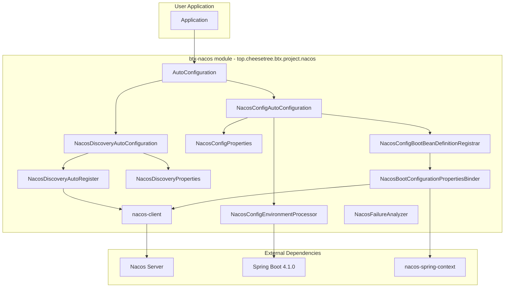
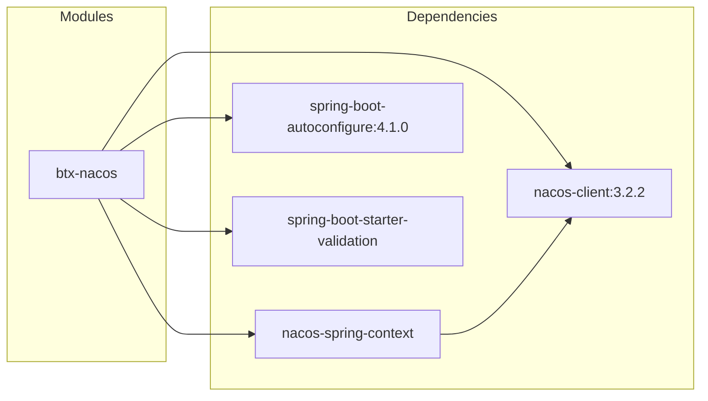

# Plan: Adapt nacos-spring-boot-project for Spring Boot 4.1.0

## Objective

Port the full [nacos-spring-boot-project](https://github.com/nacos-group/nacos-spring-boot-project) functionality to the existing [`btx-projects/btx-nacos`](btx-projects/btx-nacos) module, adapting it to work with Spring Boot 4.1.0 (the version used by this project).

All code will use the **`top.cheesetree.btx.project.nacos`** package namespace (btx project convention).

## Current State

The existing [`btx-nacos`](btx-projects/btx-nacos) module is minimal:
- **pom.xml**: Only depends on `nacos-client:3.2.2` and inherits `spring-boot-autoconfigure:4.1.0` from parent
- **2 Java files**:
  - [`NacosConfigure.java`](btx-projects/btx-nacos/src/main/java/top/cheesetree/btx/project/nacos/config/NacosConfigure.java) — Simple `@Configuration` with `@NacosPropertySource`
  - [`NacosBootConfigurationPropertiesBinder.java`](btx-projects/btx-nacos/src/main/java/com/alibaba/boot/nacos/config/binder/NacosBootConfigurationPropertiesBinder.java) — Custom binder **will be moved** to btx namespace

## Reference Project Structure (nacos-spring-boot-project v0.3.0-RC)

The reference project has these modules:
- `nacos-spring-boot-base` — `NacosFailureAnalyzer`, `PropertiesUtils`
- `nacos-config-spring-boot-autoconfigure` — Core config auto-configuration (`NacosConfigAutoConfiguration`, `NacosConfigProperties`, `NacosConfigBootBeanDefinitionRegistrar`, `NacosBootConfigurationPropertiesBinder`, `NacosConfigEnvironmentProcessor`, `NacosConfigConstants`)
- `nacos-config-spring-boot-starter` — Starter POM
- `nacos-config-spring-boot-actuator` — Actuator endpoints
- `nacos-discovery-spring-boot-autoconfigure` — Discovery auto-configuration (`NacosDiscoveryAutoConfiguration`, `NacosDiscoveryAutoRegister`)
- `nacos-discovery-spring-boot-starter` — Starter POM
- `nacos-discovery-spring-boot-actuator` — Actuator endpoints
- `nacos-spring-boot-aot` — GraalVM AOT support

## Key Adaptations for Spring Boot 4.1.0

| Concern | Reference (SB 2.6.3) | Adaptation for SB 4.1.0 |
|---------|----------------------|------------------------|
| `javax.*` imports | javax.validation, etc. | `jakarta.*` namespace |
| `spring.factories` | Auto-configuration registration | `org.springframework.boot.autoconfigure.AutoConfiguration.imports` (newer format) |
| `Binder` API | `org.springframework.boot.context.properties.bind.Binder` | Same API, verify compatibility |
| `EnvironmentPostProcessor` | Same | Still supported |
| `@ConfigurationProperties` | Same | Still supported |
| GraalVM AOT | Separate module | Use Spring Boot 4's built-in AOT support |
| Jakarta Servlet | javax.servlet | `jakarta.servlet` |
| Package namespace | `com.alibaba.boot.nacos.*` | `top.cheesetree.btx.project.nacos.*` |

## Detailed Implementation Steps

### Step 1: Update [btx-nacos/pom.xml](btx-projects/btx-nacos/pom.xml)

Add the following dependencies:
- `nacos-spring-context` — core Spring integration from Nacos (provides `@NacosPropertySource`, `NacosConfigurationPropertiesBinder`, etc.)
- `nacos-api` — Nacos API
- `spring-boot-starter-validation` — for Jakarta validation

Remove:
- Direct `nacos-client` dependency (will be pulled transitively by `nacos-spring-context`)

### Step 2: Move [NacosBootConfigurationPropertiesBinder.java](btx-projects/btx-nacos/src/main/java/com/alibaba/boot/nacos/config/binder/NacosBootConfigurationPropertiesBinder.java)

**Move from**: `com.alibaba.boot.nacos.config.binder.NacosBootConfigurationPropertiesBinder`
**Move to**: `top.cheesetree.btx.project.nacos.config.binder.NacosBootConfigurationPropertiesBinder`

Delete the old file at `com/alibaba/boot/nacos/config/binder/` and create the new one. Update to:
- Use `jakarta.annotation` instead of `javax.annotation` if applicable
- Ensure compatibility with Spring Boot 4.1.0 `Binder` API
- Use `ResolvableType.forClass()` approach

### Step 3: Create [NacosConfigConstants.java](btx-projects/btx-nacos/src/main/java/top/cheesetree/btx/project/nacos/config/NacosConfigConstants.java)

**Package**: `top.cheesetree.btx.project.nacos.config`

Port from reference project:
- `PREFIX = "nacos.config"`
- `ENABLED` property key
- `NACOS_BOOTSTRAP` property key

### Step 4: Create [NacosConfigProperties.java](btx-projects/btx-nacos/src/main/java/top/cheesetree/btx/project/nacos/config/properties/NacosConfigProperties.java)

**Package**: `top.cheesetree.btx.project.nacos.config.properties`

A `@ConfigurationProperties("nacos.config")` class with:
- `serverAddr`, `contextPath`, `encode`, `endpoint`
- `namespace`, `accessKey`, `secretKey`
- `autoRefresh`, `dataId`, `group`, `type`
- Nested `Bootstrap` and `Config` static inner classes
- Jakarta Validation annotations for required fields

### Step 5: Create [NacosConfigBootBeanDefinitionRegistrar.java](btx-projects/btx-nacos/src/main/java/top/cheesetree/btx/project/nacos/config/autoconfigure/NacosConfigBootBeanDefinitionRegistrar.java)

**Package**: `top.cheesetree.btx.project.nacos.config.autoconfigure`

Registers `NacosBootConfigurationPropertiesBinder` as a bean when Nacos config is enabled.

### Step 6: Create [NacosConfigAutoConfiguration.java](btx-projects/btx-nacos/src/main/java/top/cheesetree/btx/project/nacos/config/autoconfigure/NacosConfigAutoConfiguration.java)

**Package**: `top.cheesetree.btx.project.nacos.config.autoconfigure`

The main auto-configuration entry point:
- `@ConditionalOnClass(name = "org.springframework.boot.context.properties.bind.Binder")`
- Conditionally enables Nacos config via `@EnableNacosConfig`
- Registers `NacosConfigProperties` as `@EnableConfigurationProperties`
- Integrates with `NacosConfigBootBeanDefinitionRegistrar`

### Step 7: Create [NacosConfigEnvironmentProcessor.java](btx-projects/btx-nacos/src/main/java/top/cheesetree/btx/project/nacos/config/autoconfigure/NacosConfigEnvironmentProcessor.java)

**Package**: `top.cheesetree.btx.project.nacos.config.autoconfigure`

An `EnvironmentPostProcessor` implementation that:
- Pre-loads Nacos logging configuration before application context refresh
- Reads `nacos.config.bootstrap.*` properties

### Step 8: Create [NacosDiscoveryAutoConfiguration.java](btx-projects/btx-nacos/src/main/java/top/cheesetree/btx/project/nacos/discovery/autoconfigure/NacosDiscoveryAutoConfiguration.java)

**Package**: `top.cheesetree.btx.project.nacos.discovery.autoconfigure`

Entry point for Nacos Discovery:
- `@ConditionalOnClass(name = "com.alibaba.nacos.client.naming.NacosNamingService")`
- `@EnableNacosDiscovery`
- Registers `NacosDiscoveryProperties` and `NacosDiscoveryAutoRegister`

### Step 9: Create [NacosDiscoveryProperties.java](btx-projects/btx-nacos/src/main/java/top/cheesetree/btx/project/nacos/discovery/properties/NacosDiscoveryProperties.java)

**Package**: `top.cheesetree.btx.project.nacos.discovery.properties`

`@ConfigurationProperties("nacos.discovery")` with:
- `serverAddr`, `contextPath`, `encode`, `endpoint`
- `namespace`, `accessKey`, `secretKey`
- `service`, `group`, `clusterName`, `ip`, `port`, `weight`

### Step 10: Create [NacosDiscoveryAutoRegister.java](btx-projects/btx-nacos/src/main/java/top/cheesetree/btx/project/nacos/discovery/autoconfigure/NacosDiscoveryAutoRegister.java)

**Package**: `top.cheesetree.btx.project.nacos.discovery.autoconfigure`

A bean that automatically registers the service with Nacos on startup:
- Implements `SmartInitializingSingleton` or uses `@PostConstruct`
- Reads `NacosDiscoveryProperties` and registers via `NamingService`

### Step 11: Create [NacosFailureAnalyzer.java](btx-projects/btx-nacos/src/main/java/top/cheesetree/btx/project/nacos/base/NacosFailureAnalyzer.java)

**Package**: `top.cheesetree.btx.project.nacos.base`

A `FailureAnalyzer` that provides descriptive error messages for Nacos configuration issues during startup.

### Step 12: Create Auto-Configuration Registration File

**File**: `src/main/resources/META-INF/spring/org.springframework.boot.autoconfigure.AutoConfiguration.imports`

Spring Boot 4.x uses this file instead of `spring.factories` for auto-configuration registration.

Content:
```
top.cheesetree.btx.project.nacos.config.autoconfigure.NacosConfigAutoConfiguration
top.cheesetree.btx.project.nacos.discovery.autoconfigure.NacosDiscoveryAutoConfiguration
```

### Step 13: Create Spring Factories File for EnvironmentPostProcessor

**File**: `src/main/resources/META-INF/spring.factories`

For `EnvironmentPostProcessor` registration (still uses `spring.factories`):
```
org.springframework.boot.env.EnvironmentPostProcessor=\
  top.cheesetree.btx.project.nacos.config.autoconfigure.NacosConfigEnvironmentProcessor
```

### Step 14: Update [NacosConfigure.java](btx-projects/btx-nacos/src/main/java/top/cheesetree/btx/project/nacos/config/NacosConfigure.java)

Update the existing user-facing configuration class to leverage the new auto-configuration infrastructure, or keep it as a simple convenience configuration.

### Step 15: Add Actuator Endpoints Optional

If Actuator is desired in the future, can add:
- `NacosConfigEndpoint` — exposes `/actuator/nacos-config` endpoint
- `NacosDiscoveryEndpoint` — exposes `/actuator/nacos-discovery` endpoint

These should be conditionally loaded when `spring-boot-starter-actuator` is on the classpath.

## File Structure After Adaptation

```
btx-projects/btx-nacos/
├── pom.xml
└── src/main/
    ├── java/top/cheesetree/btx/project/nacos/
    │   ├── base/
    │   │   └── NacosFailureAnalyzer.java
    │   ├── config/
    │   │   ├── NacosConfigConstants.java
    │   │   ├── NacosConfigure.java              (existing, updated)
    │   │   ├── autoconfigure/
    │   │   │   ├── NacosConfigAutoConfiguration.java
    │   │   │   ├── NacosConfigBootBeanDefinitionRegistrar.java
    │   │   │   └── NacosConfigEnvironmentProcessor.java
    │   │   ├── binder/
    │   │   │   └── NacosBootConfigurationPropertiesBinder.java  (moved from com.alibaba.*)
    │   │   └── properties/
    │   │       └── NacosConfigProperties.java
    │   └── discovery/
    │       ├── autoconfigure/
    │       │   ├── NacosDiscoveryAutoConfiguration.java
    │       │   └── NacosDiscoveryAutoRegister.java
    │       └── properties/
    │           └── NacosDiscoveryProperties.java
    └── resources/
        └── META-INF/
            ├── spring/
            │   └── org.springframework.boot.autoconfigure.AutoConfiguration.imports
            └── spring.factories
```

Old file to delete:
```
src/main/java/com/alibaba/boot/nacos/config/binder/NacosBootConfigurationPropertiesBinder.java
```

## Mermaid Diagram: Component Architecture



## Dependency Graph



## Execution Order

1. Update `pom.xml` with new dependencies
2. Move `NacosBootConfigurationPropertiesBinder.java` from `com.alibaba.boot.nacos` to `top.cheesetree.btx.project.nacos.config.binder` and update it for SB 4.1.0
3. Create constants and properties classes (`NacosConfigConstants`, `NacosConfigProperties`)
4. Create auto-configuration classes (`NacosConfigAutoConfiguration`, `NacosConfigBootBeanDefinitionRegistrar`)
5. Create environment processor (`NacosConfigEnvironmentProcessor`)
6. Create discovery auto-configuration (`NacosDiscoveryAutoConfiguration`, `NacosDiscoveryProperties`, `NacosDiscoveryAutoRegister`)
7. Create `NacosFailureAnalyzer`
8. Create resource files (`AutoConfiguration.imports`, `spring.factories`)
9. Update existing `NacosConfigure.java`
10. Delete old `com/alibaba/boot/nacos/` source tree
11. Verify compilation with `mvn compile -pl btx-projects/btx-nacos`
